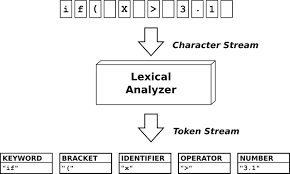

# Lexer in Compiler

The **Lexer** (or lexical analyzer) is a fundamental component of a compiler responsible for breaking down the source code into a sequence of **tokens**.

Tokens are meaningful units, such as keywords, identifiers, operators, and literals, that are recognized as the first step in translating source code into an abstract representation.

---

## Responsibilities

- **Tokenization**: Scans the input source code and identifies sequences of characters that form valid tokens.
- **Classification**: Categorizes each token based on its type (e.g., keyword, integer, string, identifier).
- **Error Handling**: Detects and reports lexical errors, such as invalid characters or malformed tokens.
- **Line and Column Tracking**: Keeps track of line and column numbers for better error reporting and debugging.

---

## Structure

The `lib/lexer` module contains the implementation of the lexer, including:

- A tokenizer that reads input and extracts tokens.
- Data structures to represent and store tokens, including their types and values.
- Functions for handling and reporting lexical errors.

The lexer prepares the code for parsing by ensuring that the source text is segmented into manageable units, laying the foundation for the subsequent stages of compilation.
